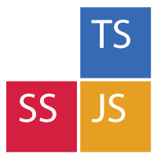

# sankaku - 3kaku - 三角

 

ScriptSharp to TypeScript via JavaScript

## The project
**Status:** On hold.

The name comes from Japanese and means _triangle_. This project has as objective converting [ScriptSharp](https://github.com/nikhilk/scriptsharp) code into [TypeScript](http://www.typescriptlang.org/) in order to allow a fast migration of big codebases.

### Important!
Please note that _sankaku_ is not meant to handle codebase conversion from ScriptSharp to TypeScript 100%. The tool is able to provide an initial TypeScript structure in order to get the most important part done automatically. Let's say that _sankaku_ will handle 50.1% of the conversion process, the remaining 49.9% is left to a manual process consisting of adjusting names and other non-structural parts of the codebase.

## The conversion process
The conversion process consists of a few steps:

1. Getting the final JavaScript output from ScriptSharp. This is more a precondition.
2. Getting the AST from such JavaScript output.
3. Processing I: Mapping classes, interfaces and enums. Initial render of placeholders.
4. Processing II: Collecting synctactic elements and merging content into placeholders.
5. Rendering.

## Compatibility
Project _sankaku_ includes everything it needs. Not included dependencies are listed below:

- _Node_: Minimal supported version is: 0.12.7

Project _sankaku_ is available on the following platforms:

- Unix/Linux (tested on RHEL)

### ScriptSharp version
This project supports conversion to TypeScript only for the following version of ScriptSharp:

- _ScriptSharp_ 0.6
